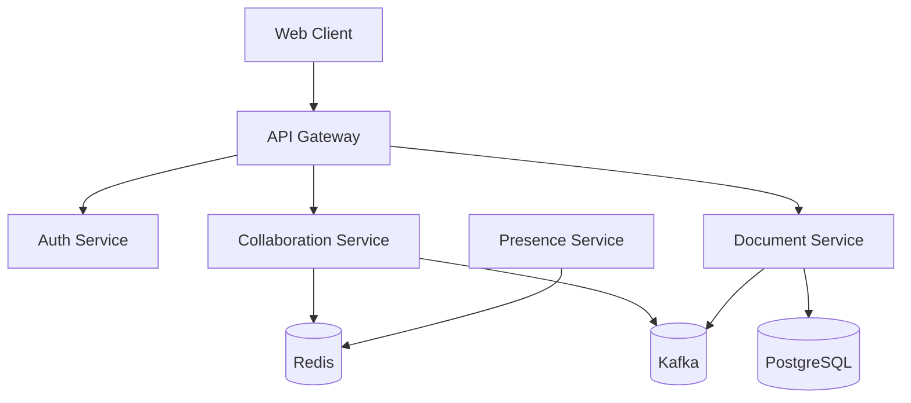
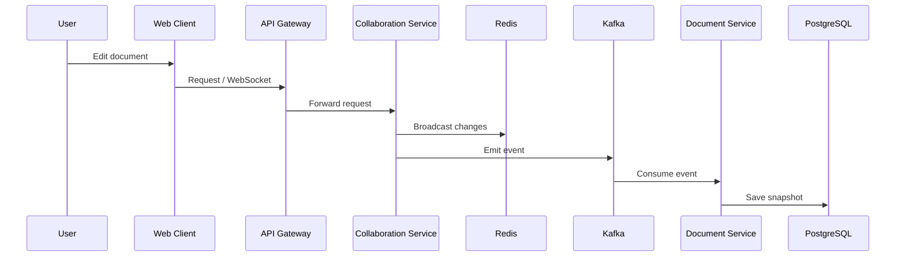

# 🧑‍💻 Real-Time Collaborative Editor (Microservices Architecture)

A scalable, production-grade **real-time collaborative editor** built using a microservices architecture. This system supports live document editing, user presence tracking, and event-driven data synchronization.

---

# 🚀 Overview

This project demonstrates how to design and build a **distributed system** capable of handling:

* Real-time collaboration (WebSockets + CRDT)
* Event-driven communication (Kafka)
* Scalable microservices
* API Gateway routing
* Presence tracking
* Observability (Prometheus + Grafana)

---

# 🧩 Architecture Diagram




---

# ⚙️ Services Breakdown

## 1. API Gateway

Handles all incoming requests and routes them to appropriate services.

**Responsibilities:**

* Authentication middleware (JWT)
* Rate limiting (Redis-backed)
* Request tracing
* Reverse proxy to services

---

## 2. Auth Service

Manages user authentication and authorization.

**Features:**

* User registration & login
* Password hashing (bcrypt)
* JWT token generation & validation
* Database-backed user storage

---

## 3. Collaboration Service (Core System)

The heart of real-time editing.

**Features:**

* WebSocket server for live editing
* CRDT-based synchronization (Yjs)
* Cursor awareness & presence tracking
* Redis Pub/Sub for horizontal scaling
* Kafka producer for event streaming

---

## 4. Document Service

Handles persistence and document lifecycle.

**Features:**

* CRUD operations for documents
* Snapshot storage of document state
* Kafka consumer for document updates
* PostgreSQL for durable storage

---

## 5. Presence Service

Tracks active users in documents.

**Features:**

* WebSocket-based presence updates
* Redis-backed state storage
* Real-time cursor & user tracking

---

# 🔄 Real-Time Data Flow



---

# 🏗️ Project Structure

```
collab-editor/
├── packages/
│   ├── shared-types/
│   ├── logger/
│   └── tracing/
│
├── services/
│   ├── api-gateway/
│   ├── auth-service/
│   ├── collaboration-service/
│   ├── document-service/
│   └── presence-service/
│
├── client/
├── tests/
│   ├── integration/
│   └── load/
│
└── infra/
    ├── local/
    │   ├── kafka/
    │   ├── redis/
    │   ├── postgres/
    │   ├── prometheus/
    │   └── grafana/
    └── k8s/
```

---

# 🧠 Key Design Concepts

## 🔹 Microservices Architecture

Each service is independently deployable and scalable.

## 🔹 Event-Driven System

Kafka enables asynchronous communication between services.

## 🔹 Real-Time Sync (CRDT)

Yjs ensures conflict-free collaborative editing.

## 🔹 Horizontal Scaling

Redis Pub/Sub allows multiple instances of services to sync.

## 🔹 Separation of Concerns

Each service has a single responsibility.

---

# 🛠️ Tech Stack

* **Backend:** Node.js / TypeScript
* **Frontend:** React
* **Realtime:** WebSockets + Yjs
* **Database:** PostgreSQL
* **Cache & Pub/Sub:** Redis
* **Streaming:** Kafka
* **Containerization:** Docker
* **Monitoring:** Prometheus + Grafana

---

# 📈 Future Improvements

* Load balancing (NGINX / Envoy)
* Kubernetes deployment (autoscaling)
* Distributed tracing (OpenTelemetry)
* Rate limiting improvements
* Multi-region deployment

---

# 💡 Why This Project Matters

This project demonstrates:

* Real-world system design skills
* Understanding of distributed systems
* Ability to build scalable backend systems
* Event-driven architecture knowledge
* Production-level thinking

---

# 🤝 Contributing

Feel free to fork, improve, and submit pull requests.

---

# 📄 License

MIT License

To make this concrete, here's what happens when you type the letter "A" into a document:
Your browser sends the edit over WebSocket to the collaboration service. Yjs transforms it against any concurrent edits (CRDT magic). The collab service publishes the transformed edit to all other connected clients via Redis Pub/Sub — this reaches users on other server instances instantly. It also publishes a document.changed event to Kafka. The document service consumes that Kafka event and decides whether enough changes have accumulated to save a new snapshot to PostgreSQL. Prometheus records that one more edit was processed. OpenTelemetry records the full span of the operation with the traceId. Grafana updates its "edits per second" graph. All of this happens in under 50 milliseconds.
That's the whole system. Every technology has one clear job, and they hand off to each other in a clear sequence.
